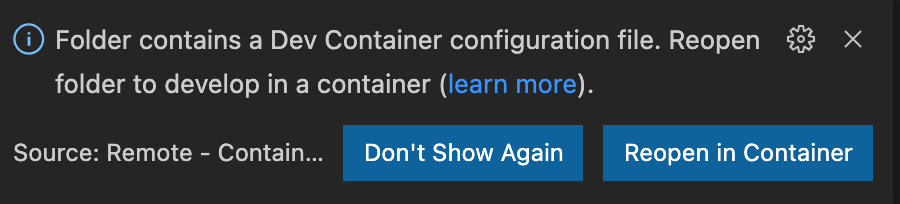
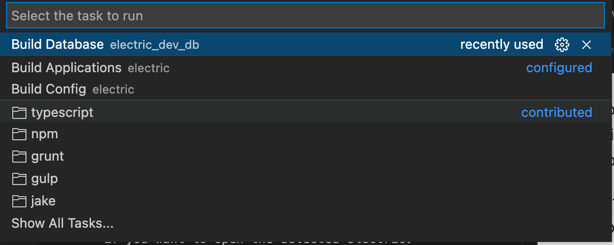

# Prerequisites

#### Docker

##### For Mac

Install Docker Desktop for MacOS as per instructions on Docker website

##### For Windows

Install Docker Desktop For Windows

-   Note, do not install any WSL during the setup. (Windows Linux Subsystem) -> this is a user preference, WSL works great for some.
-   You'll need to go into windows configurations and uncheck the use WSL options
-   Once installed, go into docker desktop, settings -> resources -> Advanced and increase memory to 10 or more GB

https://www.docker.com/products/docker-desktop/

#### VS Code

Install VS Code

https://marketplace.visualstudio.com/items?itemName=ms-vscode-remote.remote-containers

Install VS Code extensions:

-   Material Icon Theme
-   Docker
-   Azure Account
-   ESLint
-   Python
-   Remote Containers extension. The Remote Containers extension allows you to develop code inside a docker container.

#### Azure CLI

Install Azure CLI via

https://docs.microsoft.com/en-us/cli/azure/install-azure-cli

The Azure CLI is used to pull the IQGeo Platform image. Whenever you need to pull the Platform image (e.g. on 'Rebuild Container') you will need to authenticate with Azure:

###### Azure Login Commands

```shell
az login
az acr login --name iqgeoproddev
```

#### Git for Windows (as of 5/30/2022) (options might be different or out of order, please update if different)

Install Git For Windows

Once in the installer:

1. Use default folder location, click next
2. Check box "Add a git bash profile to Windows Terminal, click next
3. Use default folder location, click next
4. Select use Vim, click next
5. Let Git decide branch name, click next
6. Git from the command line and also from 3rd-party software, click next
7. Use bundled OpenSSH, click next
8. Use the Open SSL Library, click next
9. IMPORTANT, select Checkout as-is, commit as-is. Click next
10. Use MinTTY, click next
11. Default merge behavior, click next
12. Git Credential Manager, click next
13. Enable file system caching, click next
14. No experimantal options should be selected, click install

# Setup

### Note:

Our Project uses the term "Modules". It is synonomous with "Folders", however when looking at paths inside docker containers, Modules
will be used as a reference for where your local workspace is.

#### Clone the `product-nmt-comsof-integration` repository

You must also clone the https://github.com/IQGeo/product-nmt-comsof-integration repository in the same folder as the `myworld-product-network-manager-comms` repository in order to properly populate the application database.

#### Update line endings:

```shell
git config core.autocrlf false

git rm --cached -r .         # Don’t forget the dot at the end

git reset --hard
```

#### Modules to get from Link and add to local workspace

-   Make sure to find the latest release folder. (i.e. 6.4 is newer than 6.3)
    https://iqgeo.sharepoint.com/sites/productdevelopmentresources/Releases/Forms/AllItems.aspx?csf=1&web=1&e=d9cUdg&cid=7049659f%2D46a2%2D4349%2D8ac8%2D2e6ef6a2ccab&id=%2Fsites%2Fproductdevelopmentresources%2FReleases%2FPlatform&viewid=42a0d35b%2Db878%2D4936%2Da638%2D59ced5cda900

        - workflow folder

#### Directory Structure

-   \<parent\>
    -   .devcontainer
    -   .vscode
    -   comms
    -   comms_dev_db
    -   custom
    -   dev_tools - 6.3.1 or later to run native js tests
    -   workflow

# Starting a Development Container

The **Visual Studio Code Remote - Containers** extension lets you use a Docker container as a full-featured development environment. It allows you to open any folder inside (or mounted into) a container and take advantage of Visual Studio Code's full feature set. The development container for Network Manager Comms contains Python, NodeJS, IQGeo Platform, and other tools and libraries to facilitate the development of the app.

The development container uses a .env file to configure the application. Create the file \<parent\>/.devcontainer/.env on your local machine with the following content:

```shell
DB_USERNAME=iqgeo
DB_PASSWORD=iqgeo
DB_NAME=iqg_comms_dev

APP_PORT=82
DB_PORT=5434
SELENIUM_PORT=4444
```

#### The below sentence could use some updating to be a bit more clear of an explination

The database username/password are used as the owner of the master _postgres_ database, and the database created for Network Manager Comms (_DB_NAME_).

#### End block of sentence to update

The APP_PORT and DB_PORT parameters are used to map Apache and PostgreSQL to ports on your local machine (Docker Port Mapping). This allows you to connect to Apache on http://localhost:APP_PORT and PostgreSQL via a PSQL client.

#### To open in VS Code

After creating the .env file, login to Azure using both of the **az login** commands above. This allows VS Code to pull the IQGeo Platform image from Azure.

-   close VS Code and reopen it in the parent folder to trigger the prompt to "Reopen in Container"
-   i.e. in your git terminal, cd into **myworld-product-network-manager-comms** directory, then type the next command

```shell
 code .
```

-   This will open VS Code and have you in the correct workspace

#### If you want to test your database connection you can run the following command

```shell
psql -U DB_USERNAME -h localhost -p DB_PORT
```

NOTE: These ports are only exposed on the Docker Host (e.g. your local machine). Inside the docker network, Apache and PostgreSQL are exposed on their default ports (80 and 5432).

With VS Code, open the \<parent\> folder. VS Code will then prompt you to open the folder in a dev container. Choose _Reopen in Container_.



VS Code will then begin building the development container. This will take a bit of time (about 10 minutes), get up and stretch!

Now create the comms database. From the _Terminal_ menu, select _Run Task..._ and then _Build Database_.



After the database has finished building, you now have a fully functioning application! From your local machine, use a browser to access http://localhost:_APP_PORT_

You may also need to run these commands:
apachectl -k restart
_Build Applications_

# Tests

Tests can be executed in the dev container by executing them through the terminal or through visual studio codes 'Run and Debug' view.

### Native JS API Tests

Before running native js tests, run the following comman inside the container terminal:

```shell
build_extract comms
```

### Troubleshooting Tips

If you've done all this and you get a `500 Server error` or `Internal server error` there is a terminal command that will allow you to see what is going on in the Apache Logs.

This is important because, locally, Apache is how we're serving our application server and connecting to the DB.

The command is `tail -n 100 /var/log/apache2/error.log`

This will log the Apache server output in your terminal, the bottom most line is most likely the error.
