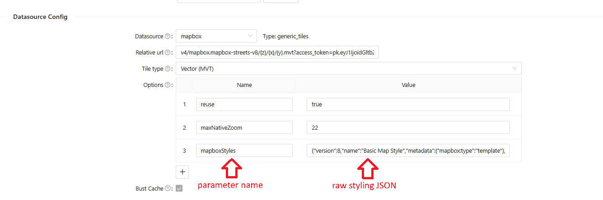
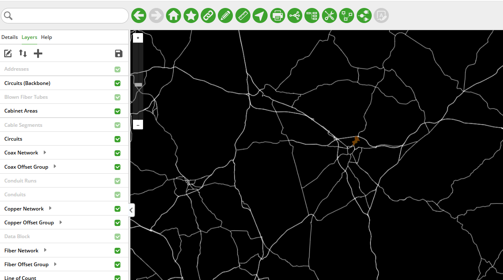
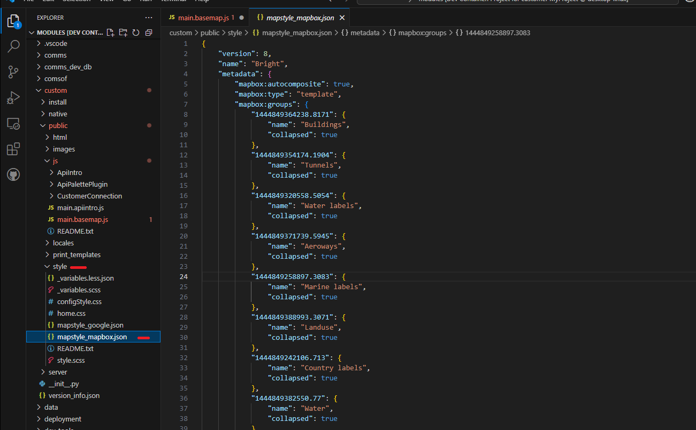
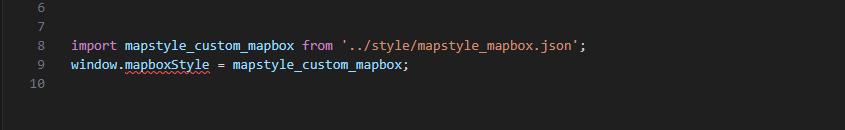
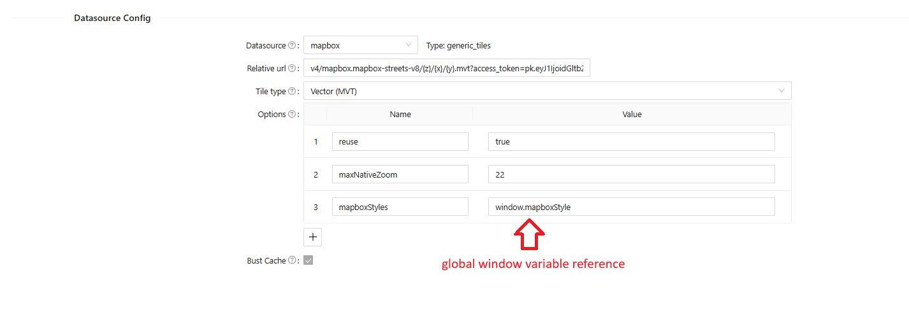
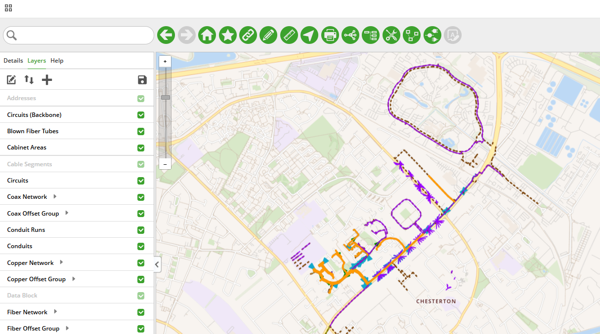

# Basemap Customization

## Table of Contents
  - [Table of Contents](#table-of-contents)
  - [Overview](#overview)
  - [Mapbox](#mapbox)
    - [Method 1 - Paste Mapbox Style directly into the Layer Configuration](#method-1---paste-mapbox-style-directly-into-the-layer-configuration)
    - [Method 2 - Style Vectors Using Code in a Custom Application](#method-2---style-vectors-using-code-in-a-custom-application)
    - [Mapbox Styling Resources](#mapbox-styling-resources)
## Overview

IQGeo customers have a variety of preferences and use cases when it comes to the visual styling of the basemaps they use within the IQGeo map interface.  With the advent of vector tiles, a wide range of "on-the-fly" styling options are now available that were previously impractical with traditional raster tiles.  This document shows basemap styling options available for Mapbox using both the Configuration GUI as well as custom code.  Setting up Mapbox as a basemap provider in the IQGeo environment is covered in the *Configuration* section of the Platform documentation.


&#8291;
## Mapbox

For customers using Mapbox vector tiles as their basemap, "raw" vectors are streamed into the interface without a fall-back default style that can then be lightly modified.  One implication is that any comprehensive styling will result in a JSON payload much bigger than the Configuration specification four-thousand character limit.  Therefore, the custom code option--Method 2--will most likely be the preferred approach.


&#8291;

&#8291;

### Method 1 - Paste Mapbox Style directly into the Layer Configuration

While not likely useful, it is possible to paste Mapbox styling JSON directly into a layer configuration:

```
{
  "version": 8,
  "name": "Basic Map Style",
  "metadata": {
    "mapbox:type": "template"
  },
  "sources": {
    "mapbox-streets": {
      "type": "vector",
      "url": "mapbox://mapbox.mapbox-streets-v8"
    }
  },
  "layers": [
    {
      "id": "background",
      "type": "background",
      "paint": {
        "background-color": "#000000"
      }
    },
    {
      "id": "road-major",
      "type": "line",
      "source": "mapbox-streets",
      "source-layer": "road",
      "filter": ["in", "class", "motorway", "trunk", "primary"],
      "paint": {
        "line-color": "#fff",
        "line-width": {
          "base": 1.4,
          "stops": [[6, 0.5], [20, 30]]
        }
      }
    }
  ],
  "center": [0, 0],
  "zoom": 2
}
```

&#8291;

&#8291;

In the Configuration window for the Mapbox layer, a parameter named `mapboxStyles` is set and the above JSON is pasted in for the value.


&#8291;



<p align="center"><i>Fig. 8: Mapbox JSON Pasted Into Config</i></p>

&#8291;

&#8291;

The minimal configuration above--background color set to black, major roads set to white, yields this:

&#8291;



<p align="center"><i>Fig. 9: Minimal Styling of Mapbox Vectors</i></p>


&#8291;

&#8291;


### Method 2 - Style Vectors Using Code in a Custom Application

As a comprehensive JSON [styling document](mapstyle_mapbox.json) for Mapbox vector tiles can easily exceed 100,000 characters, the custom code option will be the likely preference.  It is a three-step process:

- add a file containing the JSON styling information to the `custom` module
- use two lines of Javascript to import that JSON into a variable and set a global window variable
- reference the global window variable in the layer's Configuration page


&#8291;

Below we have put the large chunk of styling JSON into a document named `mapstyle_mapbox.json` and place it in the `./modules/custom/public/js/style` directory.

&#8291;



<p align="center"><i>Fig. 10: Mapbox JSON file as Part of Custom Application</i></p>

&#8291;
&#8291;

In the main Javascript page of the custom application, add the following two lines near the top of your script:

&#8291;




<p align="center"><i>Fig. 11: Importing Google JSON Style File and Setting a Global Window Variable</i></p>

&#8291;
&#8291;
&#8291;

The first line imports the JSON from the file into a variable.

&#8291;
The second line takes the variable from the line above and sets a global window variable.


&#8291;
&#8291;



<p align="center"><i>Fig. 12: Using Mapbox Styling Global Window Variable in the Configuration</i></p>

&#8291;
&#8291;

The comprehensive styling yields this result:
&#8291;
&#8291;



<p align="center"><i>Fig. 13: Comprehensive Mapbox Custom Style Applied to Vector Tiles</i></p>

&#8291;
&#8291;
### Mapbox Styling Resources

- The above example [is available here](mapstyle_mapbox.json). It was taken from a [Mapbox repo of samples](https://github.com/mapbox/mapbox-gl-styles).
&#8291;
- Mapbox customers can access Mapbox Studio to create custom styling schemes.
&#8291;

