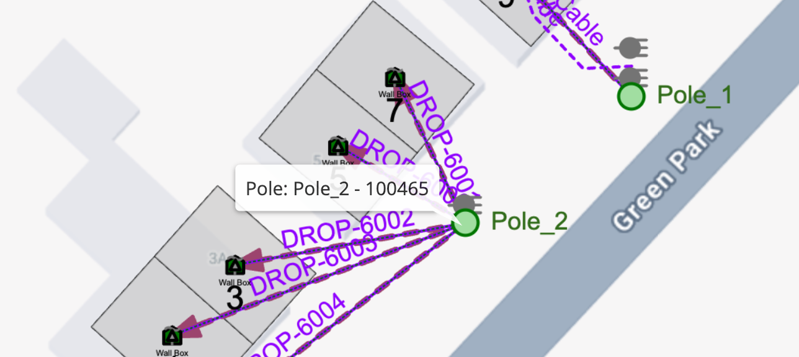

# Custom Layer Rendering - Overview

## Table of Contents

-   [Custom Layer Rendering - Overview](#custom-layer-rendering---overview)
    -   [Table of Contents](#table-of-contents)
    -   [Tool Description](#tool-description)
    -   [How to use the tool](#how-to-use-the-tool)

---

## Tool Description

The Custom Layer Rendering Sample demonstrates how you can customize layer rendering, allowing you to provide additional information to your users and/or customize the look and feel of a specific rendering layer

## How to use the tool

This tool is available in the `main.nmt_samples.js` application configuration file. To use it all you have to do is hover the mouse over a Structure or Address and a Label will be shown with the Feature title and its ID (Fig. 1)

<i>Fig. 1: Custom Layer Rendering output: Note the Label showing the Pole name and ID</i>

