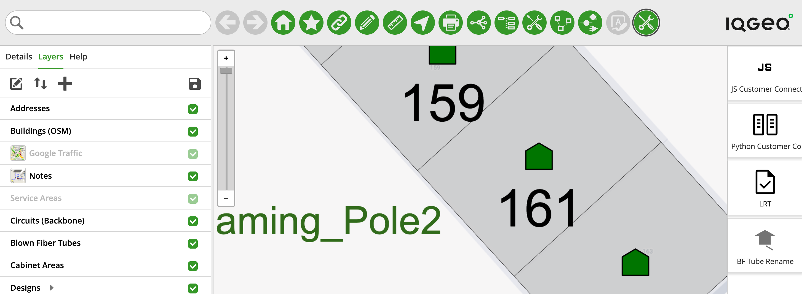
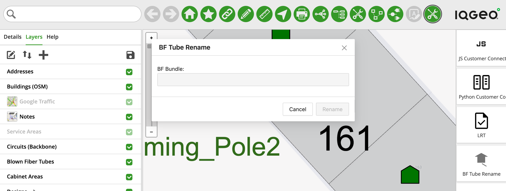
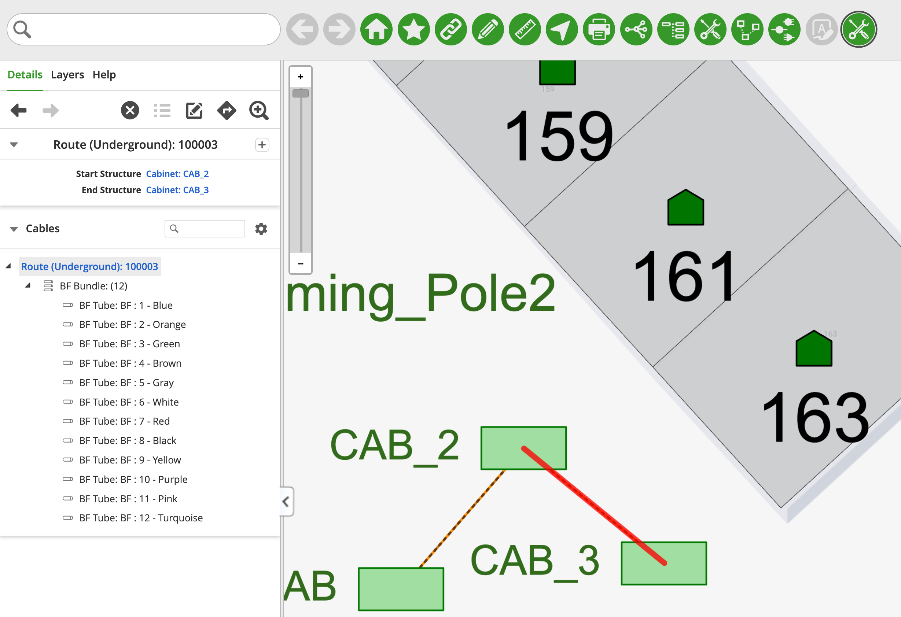

# Blown Tube Renaming - Overview

## Table of Contents

- [Blown Tube Renaming - Overview](#blown-tube-renaming---overview)
  - [Table of Contents](#table-of-contents)
  - [Tool Description](#tool-description)
  - [How to use the tool](#how-to-use-the-tool)

---

## Tool Description

The Blown Tube Renaming Tool automatically renames the Blown Tube Fibers, adding the fiber color to the end of each fiber name string. This is a handy information to have in the Fiber's name to quickly identify each individual fiber by its color.

## How to use the tool

This tool is available in the `main.nmt_samples.js` application configuration file inside the "Samples Menu" option, clicking on it will open the Palette Menu to the right side of the map

<i>Fig. 1: "Samples Menu" option location and the Palette menu open to the right side of the map</i>

Click the "BF Tube Rename" button on the Palette Menu and a pop-up window will show with a brief description of the tool, click the "OK" button and the tool window will show up (Fig. 2)

<i>Fig. 2: The Blown Fiber Rename Tool window</i>

To use the tool click on a Blown Fiber Tube and the tool will automatically select the Blown Fiber Bundle that the Fiber is part of, once a Blown Fiber Bundle is selected the "Rename" button will be enabled, and clicking on it will rename all the Tubes within the Bundle, adding the color of each tube to the end of its name (Fig. 3).

If you want to customize (or localise) the colors, please refer to the [Blown Tube Renaming Deep Dive](./Blown_Tube_Renaming_DeepDive.md).

<i>Fig. 3: The result of running the rename tool. You can see in the "Details" tab that after the name of each of the Tubes in the selected Bundle the color is shown</i>
