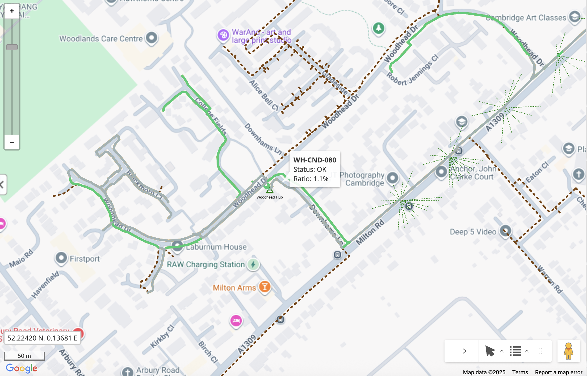

# Conduit Capacity - Overview

## Table of Contents

- [Conduit Capacity - Overview](#rest-apis---overview)
  - [Table of Contents](#table-of-contents)
  - [Tool Description](#tool-description)
  - [How to use the tool](#how-to-use-the-tool)

---

## Tool Description

The Conduit Capacity sample demonstrates how to visualize conduit utilization dircetly on the map by calculatin the fill ratio of conduits within the current map window. It uses the IQGeo JS API to query conduit features, retrieve related cable data, and visualize capacity status using color-coded map overlays.

**NOTE:** Depending on the amount of conduits, consider creating a python controller to reduce high netwrok traffic on client side. Navigate to the `python_customer_controller` code sample for more information on how to create a python controller. 

This sample consists of three files:

- `conduit_capacity_modal.js` — React-based user interface that allows users to trigger the capacity calculation and view the visual results.  
- `conduit_capacity_builder.js` — Logic class that performs the conduit capacity calculations and determines the capacity status (e.g., OK, Empty, Overfull).
- `conduit_capacity_plugin.js` - Plugin file that adds the sample to the DevRel sample menu on the IQGeo application.

The tool highlights conduits using the following color scheme:

| Status | Color | Meaning |
|--------|--------|---------|
| **OK** | Green (`#2ecc71`) | Conduit fill ratio is within acceptable limits |
| **EMPTY** | Gray (`#a1b3b3ff`) | No cables found inside the conduit |
| **OVERFILL** | Red (`#e74c3c`) | Conduit is overfilled beyond capacity |
| **No data** | Yellow (`#f1c40f`) | Missing diameter information for conduit or cables |

---

## How to use the tool

The sample is located at:  
`modules/utils-devrel-samples/public/js/Samples/conduit_capacity`

### Steps to use

1. **Open the map** to the desired area containing conduit data.  
   The tool uses the current map’s bounding box to determine which conduits to analyze.

2. **Launch the Conduit Capacity Modal.**  
   Once open, click the **“Visualize”** button to start the analysis.

3. **Behind the scenes**, the tool will:
   - Retrieve all conduits within the visible map bounds.
   - For each conduit, get its related cable segments and their diameters.
   - Compute the fill ratio based on conduit and cable diameters.
   - Determine the status (OK, Empty, Overfull, No data).
   - Display each conduit on the map with a corresponding color-coded line.

4. **View results on the map.**  
   The conduits will appear as colored lines, with tooltips showing the following information:
   - Conduit name
   - Status
   - Calculated fill ratio (in percentage)

   Example tooltip output:

   
   
<i>Fig. 1: Conduit Capacity map visualization output example including temporary map layer added.</i>

