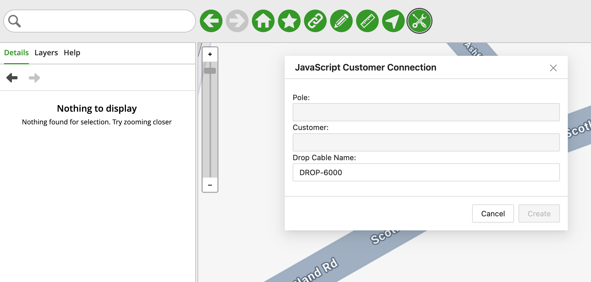
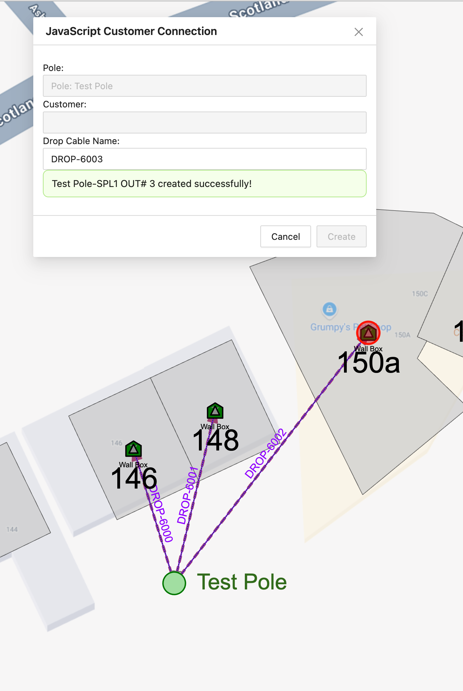

# Customer Connection - JavaScript - Overview

## Table of Contents

- [Customer Connection - JavaScript - Overview](#customer-connection---javascript---overview)
  - [Table of Contents](#table-of-contents)
  - [Tool Description](#tool-description)
  - [How to use the tool](#how-to-use-the-tool)

---

## Tool Description

The Customer Connection tool automates the creation of a connection between a Pole and an Address within the map.

If an user were to manually create a connection between a Pole that has no underlying equipment and and Address without equipment as well he would have to

- Add a Splice Closure to the Pole
- Add a Fiber Splitter to the Pole
- Add a Wall Box to the Address
- Add an ONT to the address
- Create a Route between the Pole and Address
- Create a Cable between the Pole and Address
- Connect the Cable to a Pin in the Fiber Splitter
- Connect the Cable to a Pin in the ONT

That's a lot of manual setting and configuration, which is time-consuming and error prone.

The tool allows the user to simply select a Pole and an Address and the tool creates the connection, including the underlying equipment if needed.

## How to use the tool

This tool is available in the "DevRel Samples App - NMT" application inside the "Samples Menu" option, clicking on it will open the Palette Menu to the right side of the map

<i>Fig. 1: "Samples Menu" option location and the Palette menu open to the right side of the map</i>

Click the "JS Customer Connection" button on the Palette Menu and a pop-up window will show with a brief description of the tool, click the "OK" button and the tool window will show up (Fig. 2)

<i>Fig. 2: The JavaScript Customer Connection Tool window</i>

To use the tool click on a Pole (represented by green circles in the map), then click on an Address (represented by green pentagons in the map).

Once you've clicked on both a Pole and an Address the "Create" button will be enabled, and clicking on it will create a connection between the Pole and the Address, as well as the underlying equipment needed for the Pole and the Address (for the Pole a Splice Closure and a Fiber Splitter are created, for the Address, a Wall Box and ONT are created).

Once a connection is created the Drop Cable Name is automatically incremented (Fig. 3)

<i>Fig. 3: The result of running the connection tool. You can see the success Alert in the window and the connection established to Address 150a. Two other connections to 146 and 148 have been previously created</i>
