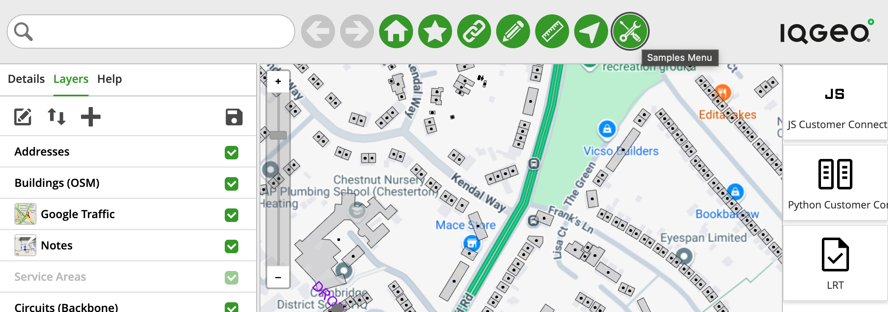
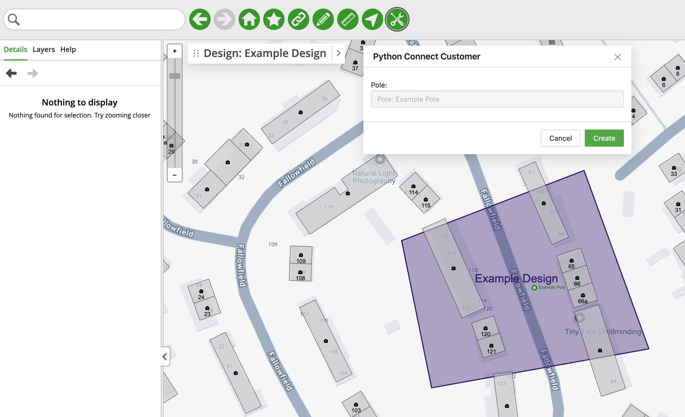
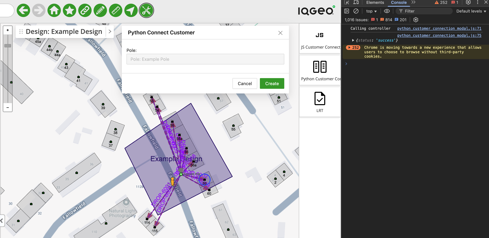

# Customer Connection - Python - Overview

## Table of Contents

- [Customer Connection - Python - Overview](#customer-connection---python---overview)
  - [Table of Contents](#table-of-contents)
  - [Tool Description](#tool-description)
  - [How to use the tool](#how-to-use-the-tool)

---

## Tool Description

The Customer Connection tool automates the creation of a connection between a Pole and an Address within the map.

If an user were to manually create a connection between a Pole that has no underlying equipment and and Address without equipment as well he would have to

- Add a Splice Closure to the Pole
- Add a Fiber Splitter to the Pole
- Add a Wall Box to the Address
- Add an ONT to the address
- Create a Route between the Pole and Address
- Create a Cable between the Pole and Address
- Connect the Cable to a Pin in the Fiber Splitter
- Connect the Cable to a Pin in the ONT

That's a lot of manual setting and configuration, which is time-consuming and error prone.

The Python tool not only automates the process, but also allows for bulk changes in the database with a single call from the client

## How to use the tool

This tool is available in the "DevRel Samples App - NMT" application inside the "Samples Menu" option, clicking on it will open the Palette Menu to the right side of the map

<i>Fig. 1: "Samples Menu" option location and the Palette menu open to the right side of the map</i>

Click the "Python Customer Connection" button on the Palette Menu and a pop-up window will show with a brief description of the tool, click the "OK" button and the tool window will show up (Fig. 2)

<i>Fig. 2: The Python Customer Connection Tool window with a Pole created within the Example Design selected</i>

To use the tool click on a Pole that is created within a Design and then click Create. The tool will connect the pole to all the addresses within 50 meters of the selected pole (Fig. 3)

<i>Fig. 3: The result of running the Python connection tool. You can see all the connection created around the pole, as well as the output in the development console</i>
