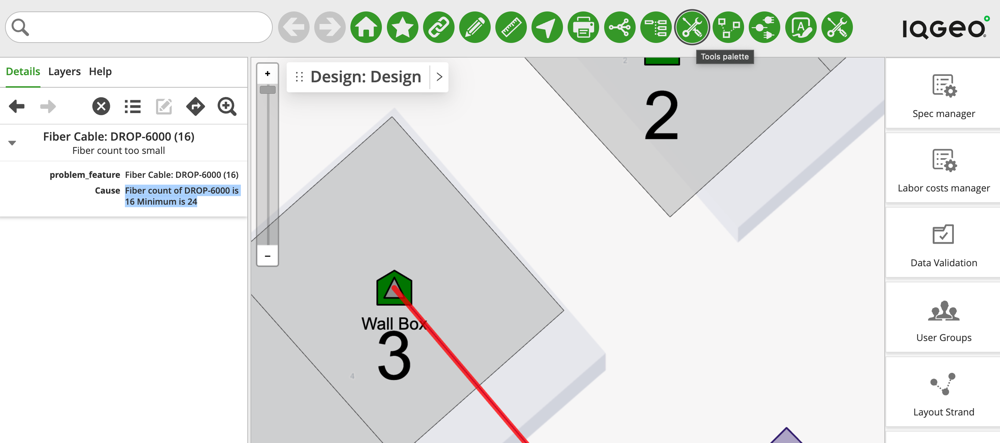
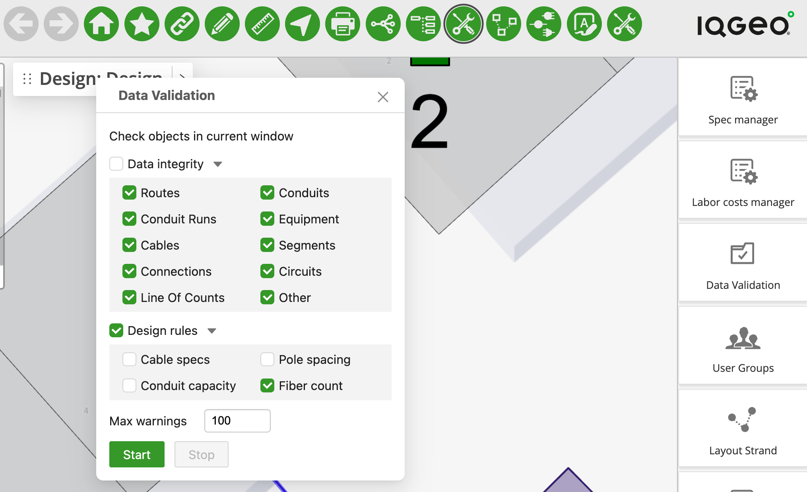
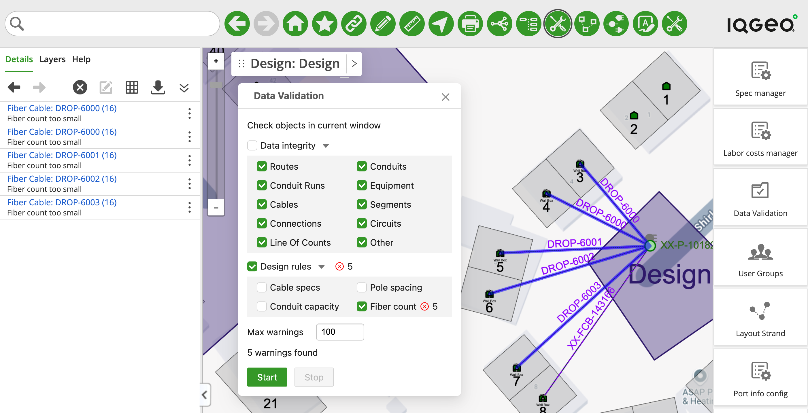
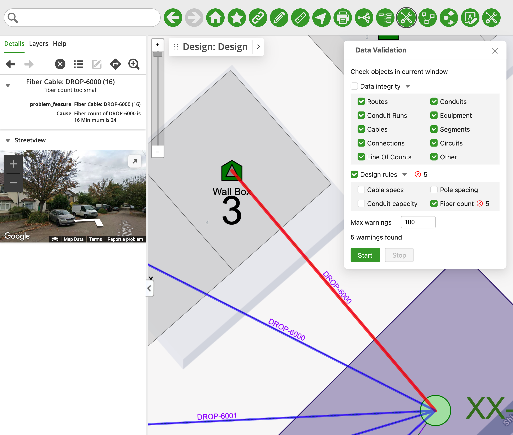

# Design Rule - Overview

## Table of Contents

-   [Design Rule - Overview](#design-rule---overview)
    -   [Table of Contents](#table-of-contents)
    -   [Tool Description](#tool-description)
    -   [How to use the tool](#how-to-use-the-tool)

---

## Tool Description

The Design Rule tool is a native Network Manager Telecom (NMT) tool that allows the user to check if the features in a given Design follow a defined rule.
The NMT Development Database comes with three pre-defined Rules: Conduit Capacity, Pole Spacing, and Specification Set. The files for these rules can be found at `comms_dev_db/public/js/design_rules`. But we have created an extra rule - Fiber Count - and will go over how to set it up. You can use this sample as a basis to create your own Design Rules.

## How to use the tool

This tool is available in the `main.nmt_samples.js` application configuration file inside the "Tools Palette" option, clicking on it will open the Palette Menu to the right side of the map (Fig. 1)

<i>Fig. 1: "Tools Palette" option location and the Palette menu open to the right side of the map. The Design Rules are within the "Data Validation" option</i>

Click the "Data Validation" option and the modal window will open. You can uncheck the box next to "Data Integrity" and keep only the "Fiber Count" box checked in the "Design Rules field". "Fiber Count" is the rule that is part of the samples and is the only one that we need to run (Fig. 2). The "Fiber Count" rule checks if all the fiber cables in the Design has a fiber count bigger than 24.

<i>Fig. 2: The Data Validation window</i>

For the image below, we have set a Design containing several cables, only one of them (XX-FCB-143166) does not break the rule. When the user clicks "Start" the selected tests are run abd the results are presented on the "Details" tab (Fig. 3), clicking in any of the Features that failed the test shows additional details, as well as focusing the map on the Feature (Fig. 4)

<i>Fig. 3: The result of running Data Validation Tool. On the left side you can see the list of cables that has failed the test</i>

<i>Fig. 4: Clicking in one of the Features that failed provide additional details. In this case the fiber count of the cable is 16 and it must be at least 24</i>

