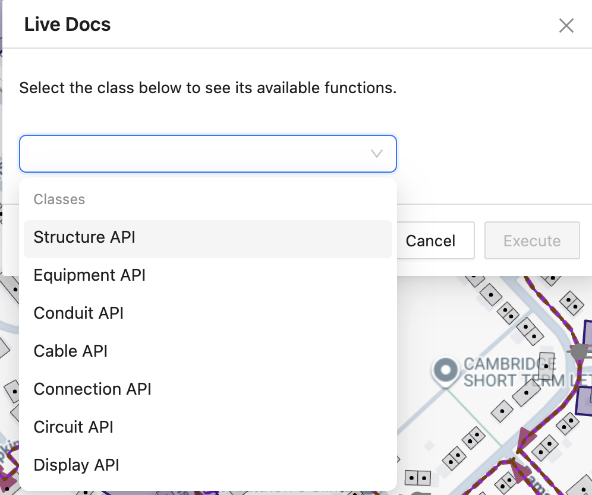
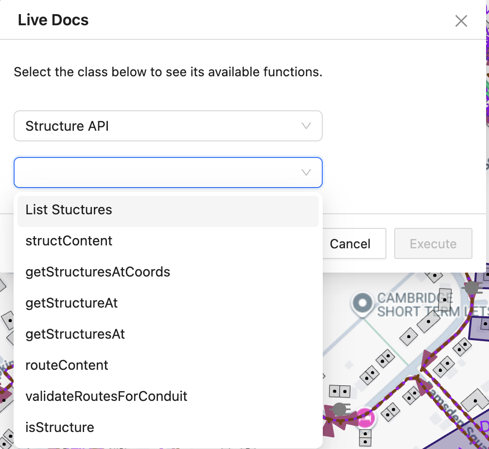
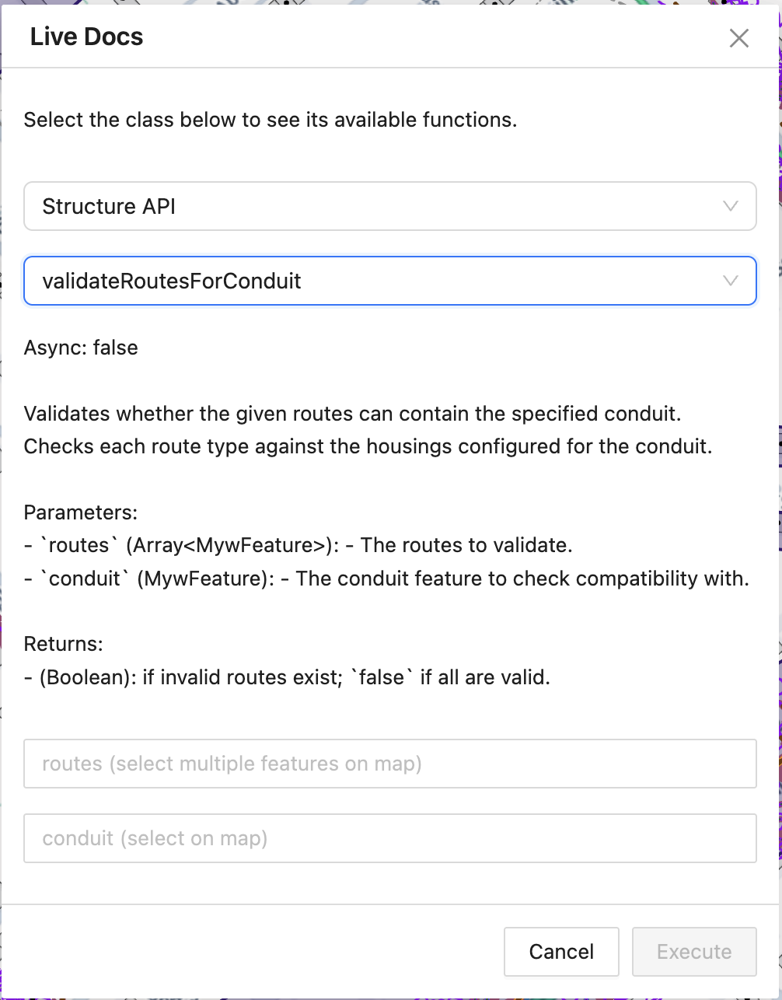

# Live Docs Sample - JavaScript - Overview

## Table of Contents

- [Live Docs Sample - JavaScript - Overview](#live-docs-sample---javascript---overview)
  - [Table of Contents](#table-of-contents)
  - [Tool Description](#tool-description)
  - [How to use the tool](#how-to-use-the-tool)

---

## Tool Description

The **Live Docs Sample** is an interactive plugin that allows users to execute API functions with custom parameters from various IQGeo modules (Structure, Equipment, Conduit, Cable, Connection, and Circuit) directly from a modal interface in NMT.

Key features:

- **Function Selection:** Choose a class and a function from the available API menus.
- **Dynamic Parameter Inputs:** Input fields are automatically rendered based on the selected function’s parameter types (numbers, strings, booleans, arrays, features, transactions, or pin ranges). 
- **Map Integration:** For feature-based parameters, users can select objects directly on the map.
- **Automatic Transaction Handling:** Transaction parameters are automatically created and committed after execution.
- **Real-Time Execution:** Functions are executed immediately with user-provided inputs, and results are logged in the console.
- **Support for Complex Types:** Handles nested arrays, objects, GeoJSON, and custom PinRange types.

This tool is intended for those who want an **interactive way to use API functionality** without writing custom scripts.

---

## How to use the tool

1. **Open the Live Docs Modal**
   
   Open the `LiveDocsPlugin` in the application. The modal will show an introductory description of the plugin. Click **OK** to proceed.

2. **Select a Class and Function**

   - Use the first dropdown to select a class (e.g., `Structure API`, `Equipment API`, etc.).
   - After selecting a class, a second dropdown will display available functions for that class.
   - Selecting a function dynamically generates input fields for its parameters.

   
   *Fig. 2: Class dropdown menus*

   
    *Fig. 3: Function dropdown menus*

3. **Fill in Parameter Values**

   - Input fields adjust based on parameter types:

     - **Number / String / Boolean:** Standard input or dropdown.
     - **Feature / Array of Features:** Click on map objects to populate.
     - **Array of Numbers / Array of Arrays:** Click on features to input coordinates.
     - **Objects / JSON / GeoJSON:** Enter JSON directly into a text area.
     - **PinRange:** Select side and define low/high pin numbers.
     - **Transaction:** Automatically created; no user input required.

   - Ensure all required parameters are filled to enable the **Execute** button.
   - Description of the function, parameters and return value is provided.

   

   *Fig. 3: Example of parameter inputs for `validateRoutesForConduit` function.*

4. **Execute the Function**

   - Click the **Execute** button to run the selected function with the provided parameters.
   - Function execution logs results in the console.
   - Asynchronous functions will return results after their promise resolves.

5. **Cancel or Exit**

   - Click the **Cancel** button to close the modal without executing any function.
   - Switching between classes or functions resets parameter inputs automatically.
