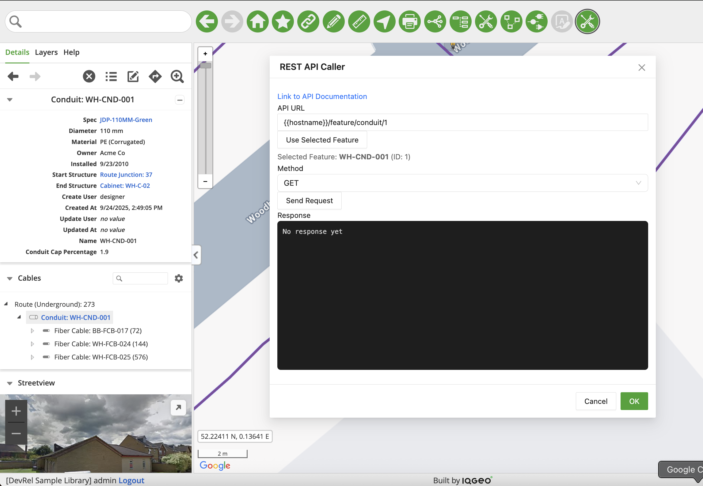
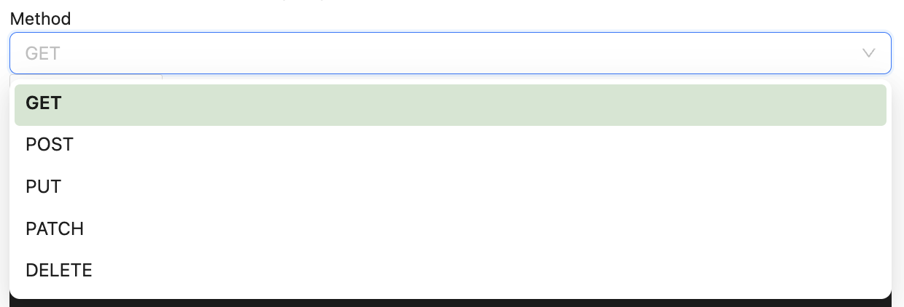
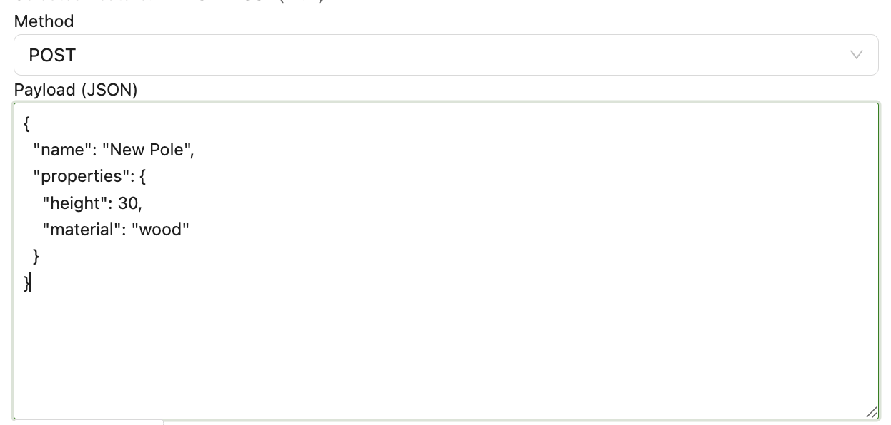

# REST API Tool - Overview

## Table of Contents

- [REST API Tool - Overview](#rest-api-caller---overview)
  - [Table of Contents](#table-of-contents)
  - [Tool Description](#tool-description)
  - [How to use the tool](#how-to-use-the-tool)

---

## Tool Description

The **REST API Tool** is an interactive plugin that allows users to test and execute REST API calls directly from a modal interface in NMT. It provides a user-friendly way to interact with the application's REST API endpoints without requiring external tools.

Key features:

- **Multiple HTTP Methods:** Support for GET, POST, PUT, PATCH, and DELETE requests.
- **Map Integration:** Select features directly from the map to automatically populate API URLs for feature-specific endpoints.
- **Request Payload Editor:** Built-in JSON editor for POST, PUT, and PATCH request bodies with syntax validation.
- **Automatic CSRF Protection:** Automatically extracts and includes CSRF tokens from cookies for authenticated requests.
- **Syntax-Highlighted Responses:** JSON responses are displayed with color-coded syntax highlighting for improved readability.
- **Feature Navigation:** When API responses contain multiple features, navigate through them with Previous/Next buttons while automatically highlighting each feature on the map.
- **Direct Documentation Access:** Quick link to the IQGeo API documentation for reference.

This tool is intended for developers and users who want an interactive way to test API endpoints and explore feature data without writing custom scripts or using external tools.

---

## How to use the tool

1. **Open the REST API Caller Modal**
   
   Open the `REST API Caller` plugin in the application. The modal will display the API testing interface with fields for URL, method, payload, and response.

2. **Enter or Select the API URL**

   - **Manual Entry:** Type the API endpoint URL directly in the **API URL** field.
     - Full URLs: `http://{{hostname}}/feature/pole/12345`
     - Relative paths: `{{hostname}}/feature/pole` (automatically prefixed with `http://`)
   
   - **Use Selected Feature:** Click the **Use Selected Feature** button to automatically populate the URL with the currently selected map feature.
     - If no feature is currently selected, the button text changes to **"Click feature on map..."**
     - Click any feature on the map to select it and auto-populate the URL as `{{hostname}}/feature/{type}/{id}`
        - Note: Be sure to populate the proper hostname
     - The selected feature's name and ID will be displayed below the URL field for confirmation.

   - **API Documentation:** Click the documentation link at the top of the modal to access the full IQGeo API reference.

   
   <p align="center"><i>Fig. 1: API URL input with feature selection option</i></p>

3. **Select the HTTP Method**

   - Use the **Method** dropdown to select the appropriate HTTP verb:
     - **GET:** Retrieve data from the API
     - **POST:** Create new resources
     - **PUT:** Update existing resources (full replacement)
     - **PATCH:** Update existing resources (partial update)
     - **DELETE:** Remove resources

   
   <p align="center"><i>Fig. 2: HTTP method dropdown menu</i></p>

4. **Enter Request Payload (if applicable)**

   - For POST, PUT, and PATCH requests, a **Payload (JSON)** text area will appear.
   - Enter your request body as valid JSON.
   - Example:
     ```json
     {
       "name": "New Pole",
       "properties": {
         "height": 30,
         "material": "wood"
       }
     }
     ```
   - The tool automatically adds appropriate headers (`Content-Type: application/json`) and CSRF tokens for authenticated requests.

   
   <p align="center"><i>Fig. 3: JSON payload editor for POST/PUT/PATCH requests</i></p>

5. **Send the Request**

   - Click the **Send Request** button to execute the API call.
   - The button will be disabled if no URL is entered.
   - While the request is processing, the button text changes to **"Calling..."** and is disabled.

6. **View the Response**

   - The **Response** section displays the API response with:
     - HTTP status code and status text (e.g., `200 OK`, `404 Not Found`)
     - Syntax-highlighted JSON response body with color-coded keys, values, strings, numbers, booleans, and null values
     - Plain text responses for non-JSON content
     - Error messages if the request fails

7. **Navigate Multiple Features (if applicable)**

   - When the API response contains multiple features (e.g., from a feature collection or array), navigation controls appear above the response area.
   - The display shows: **"Showing feature X of Y"**
   - Use the **← Previous** and **Next →** buttons to navigate through features.
   - As you navigate, each feature is automatically highlighted and zoomed to on the map.
   - Supported response formats:
     - `MywFeatureCollection` with a `features` array
     - Plain arrays of objects with `id` or `feature_id` properties
     - Single feature objects

   
   <p align="center"><i>Fig. 5: Navigation controls for multi-feature responses</i></p>

8. **Cancel or Exit**

   - Click the **X** button or the modal overlay to close the REST API Caller.
   - All entered values (URL, method, payload) are preserved if you reopen the modal during the same session.