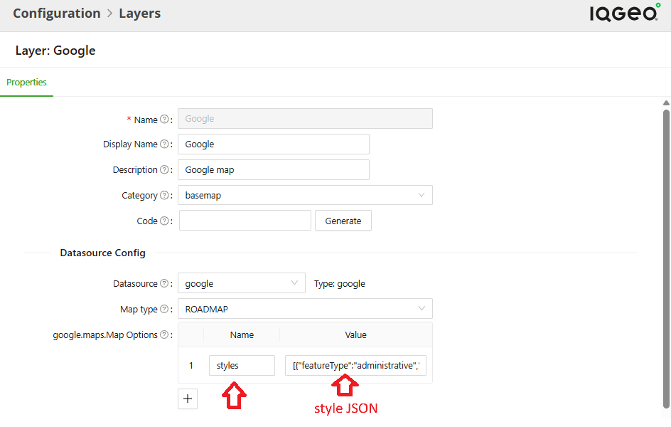
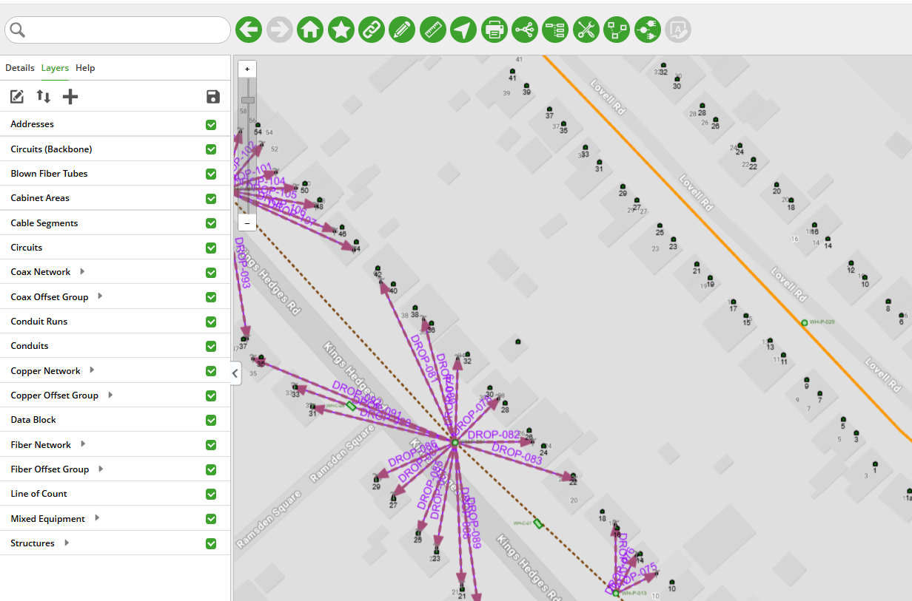
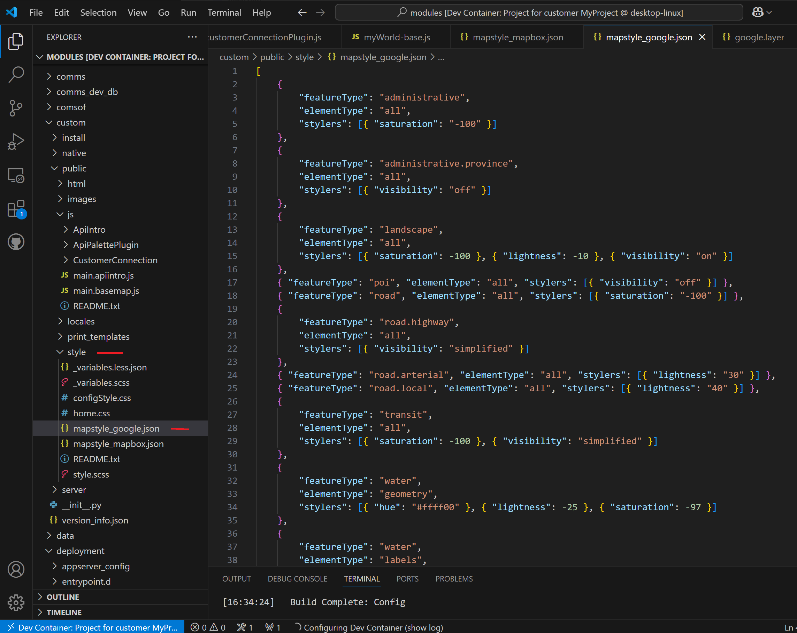
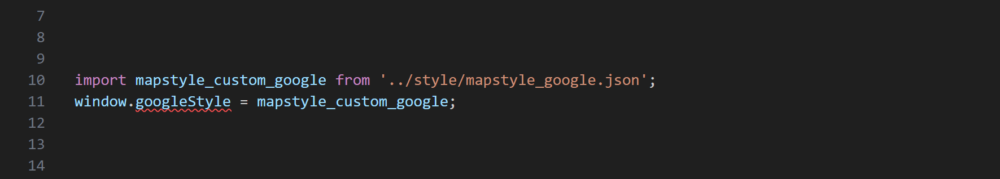
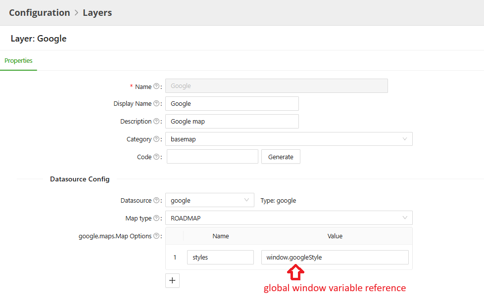
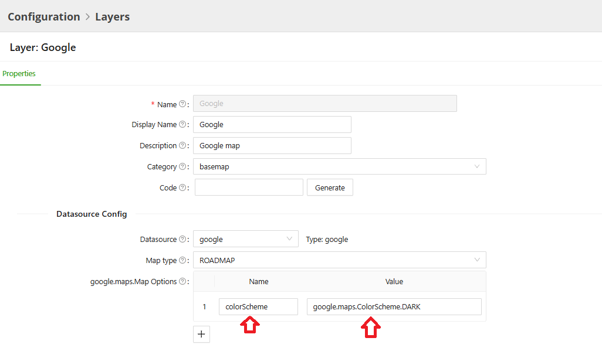
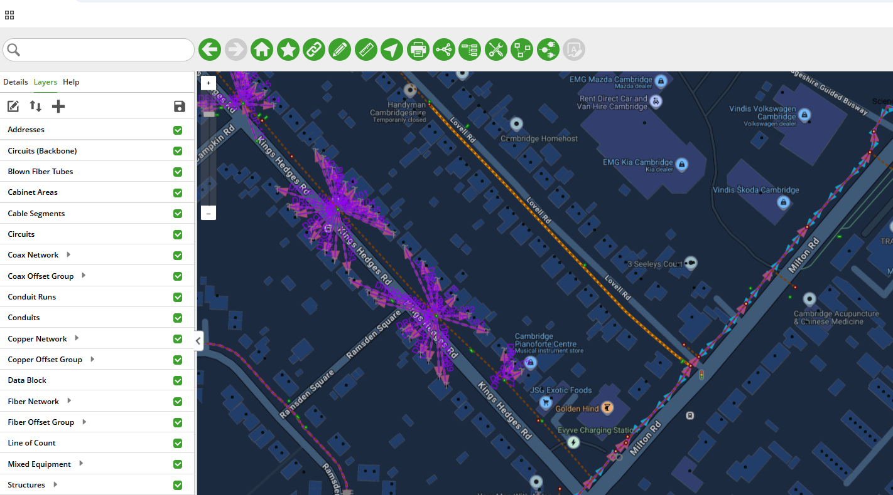

# Google Basemap Customization

  - [Table of Contents](#table-of-contents)
  - [Overview](#overview)
  - [Google Maps](#google-maps)
    - [Method 1 - Paste Style directly into the Layer Configuration](#method-1---paste-style-directly-into-the-layer-configuration)
    - [Method 2 - Using Code in a Custom Application](#method-2---using-code-in-a-custom-application)
    - [Method 3 - Using The Google Maps Dark Color Scheme](#method-3---using-the-google-maps-dark-color-scheme)
    - [Google Maps Styling Resources](#google-maps-styling-resources)

## Overview

IQGeo customers have a variety of preferences and use cases when it comes to the visual styling of the basemaps they use within the IQGeo map interface.  With the advent of vector tiles, a wide range of "on-the-fly" styling options are now available that were previously impractical with traditional raster tiles.  This document shows basemap styling options available for Google Maps using both the Configuration GUI as well as custom code.  Setting up Google Maps as a basemap provider in the IQGeo environment is covered in the *Configuration* section of the Platform documentation.

&#8291;
&#8291;

   
## Google Maps

There are three methods to customize the Google Maps basemap

### Method 1 - Paste Style directly into the Layer Configuration

Consider the following [styling JSON](mapstyle_google.json) for Google Maps that is changing lightness and saturation values to give the basemap a more grayscale feel while at the same time removing "Points of Interest" (POIs) altogether to declutter the basemap:
&#8291;
&#8291;

   
```
[
    {
        "featureType": "administrative",
        "elementType": "all",
        "stylers": [{ "saturation": "-100" }]
    },
    {
        "featureType": "administrative.province",
        "elementType": "all",
        "stylers": [{ "visibility": "off" }]
    },
    {
        "featureType": "landscape",
        "elementType": "all",
        "stylers": [{ "saturation": -100 }, { "lightness": -10 }, { "visibility": "on" }]
    },
    { "featureType": "poi", "elementType": "all", "stylers": [{ "visibility": "off" }] },
    { "featureType": "road", "elementType": "all", "stylers": [{ "saturation": "-100" }] },
    {
        "featureType": "road.highway",
        "elementType": "all",
        "stylers": [{ "visibility": "simplified" }]
    },
    { "featureType": "road.arterial", "elementType": "all", "stylers": [{ "lightness": "30" }] },
    { "featureType": "road.local", "elementType": "all", "stylers": [{ "lightness": "40" }] },
    {
        "featureType": "transit",
        "elementType": "all",
        "stylers": [{ "saturation": -100 }, { "visibility": "simplified" }]
    },
    {
        "featureType": "water",
        "elementType": "geometry",
        "stylers": [{ "hue": "#ffff00" }, { "lightness": -25 }, { "saturation": -97 }]
    },
    {
        "featureType": "water",
        "elementType": "labels",
        "stylers": [{ "lightness": -25 }, { "saturation": -100 }]
    }
]
```

&#8291;
&#8291;

In the *Configuration --> Layers* window choose 'Google' layer.  In the **Datasource Config** section, there will be a section labeled `google.maps.Map Options`
- set up a parameter named `styles`
- in the Value input, paste in the JSON above 


&#8291;
&#8291;



<p align="center"><i>Fig. 1: Pasting Google Maps styling JSON in the Configuration window</i></p>


&#8291;
&#8291;

The resulting basemap now looks something like this:

&#8291;
&#8291;


<p align="center"><i>Fig. 2: Google Maps Grayscale basemap Without Points of Interest </i></p>
&#8291;
&#8291;

**LIMITATION:** All of the specification information for a given layer is subject to an overall limit of 4000 characters. If your styling JSON alone exceeds 3700-3800 characters, please use the method below as a workaround.

### Method 2 - Using Code in a Custom Application

An alternate method for styling specifications that go well beyond 3700-3800 character limit is to 
- add a file containing the JSON styling information to your `custom` module
- use two lines of Javascript to import that JSON into a variable and set a global window variable
- reference the global window variable in the layer's Configuration page


&#8291;
&#8291;

Below, we have taken the JSON above and created a file named `mapstyle_google.json`.  We have placed that file in the the `/modules/custom/public/js/style` directory:

&#8291;



<p align="center"><i>Fig. 3: Google Maps JSON file as Part of Custom Application</i></p>

&#8291;
&#8291;

In the main Javascript page of the custom application, add the following two lines near the top of your script:

&#8291;




<p align="center"><i>Fig. 4: Importing Google JSON Style File and Setting a Global Window Variable</i></p>

&#8291;
&#8291;
&#8291;

The first line imports the JSON from the file into a variable.

&#8291;
The second line takes the variable from the line above and sets a global window variable.


&#8291;
&#8291;



<p align="center"><i>Fig. 5: Using Google Styling Global Window Variable in the Configuration</i></p>

&#8291;
&#8291;

The result is the same grayscale map pictured in Figure 2.

**IMPORTANT:** The custom style will only be available to applications where the `window.googleStyle` global window variable has been properly configured.  Other applications that use the same Google layer configuration but do not have the global variable `window.googleStyle` set up will display the default style.

### Method 3 - Using The Google Maps Dark Color Scheme


While the Google Map style JSON featured above offers fine-grained control over styling individual types of features, one has the option to specify the out-of-the-box *Dark* color scheme using the `colorScheme` parameter in the following manner:
&#8291;



<p align="center"><i>Fig. 6: Using the default "Dark" Color Scheme for Google Maps</i></p>

&#8291;
&#8291;

The result: 

&#8291;



<p align="center"><i>Fig. 7: Google Maps Dark Map Style</i></p>

&#8291;
&#8291;
### Google Maps Styling Resources

[The JSON style used above is available here.](mapstyle_google.json)

Google has its own *Google Maps Styling Wizard* available as an online tool where one can create a custom style visually and export the underlying JSON.


In addition, there are third-party websites that display galleries of custom styles where the underlying JSON specification is available for download. 


&#8291;

&#8291;
