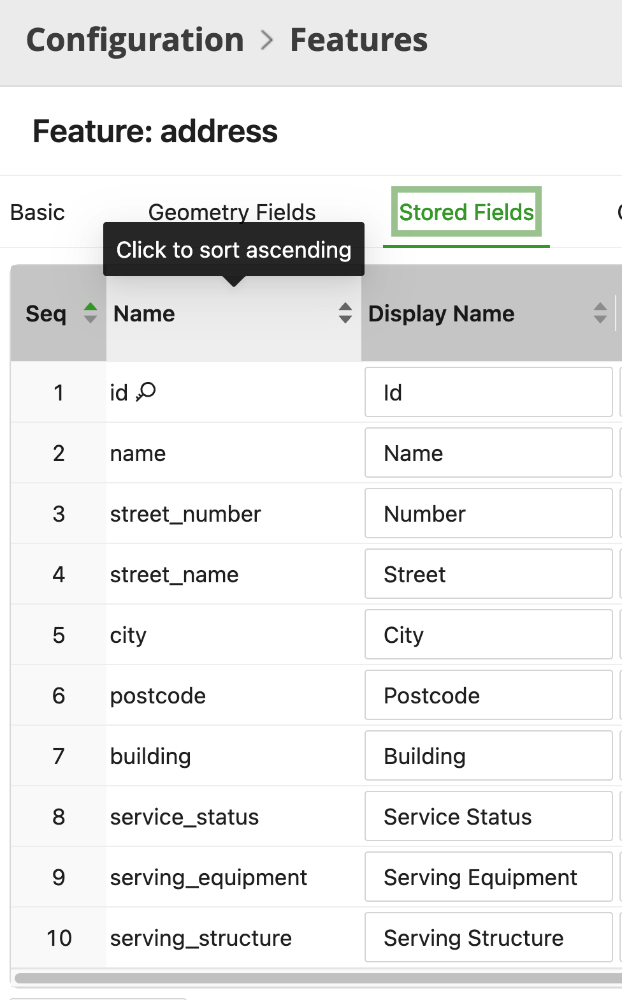
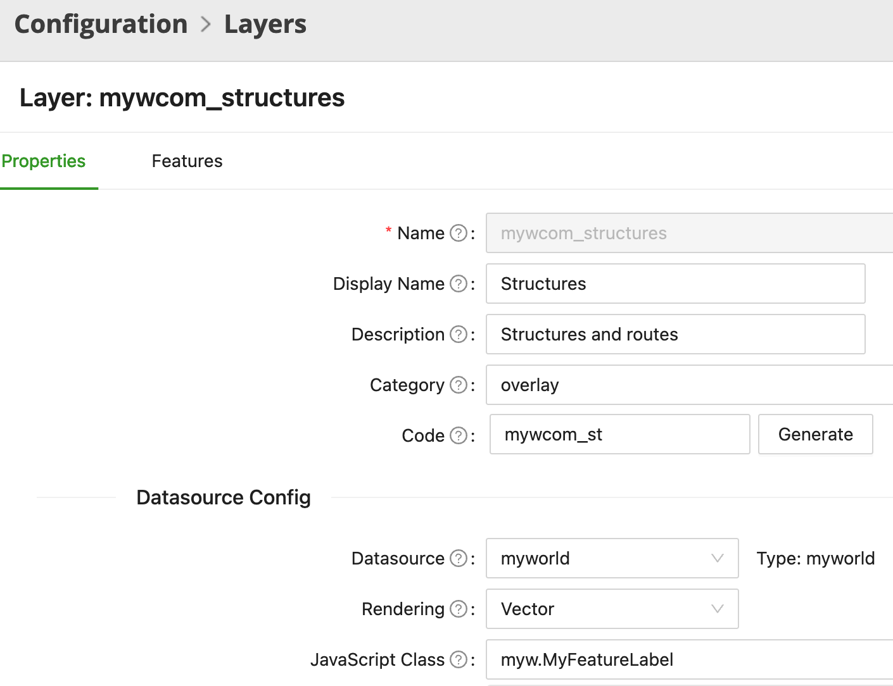

# Custom Layer Rendering - Code Deep Dive

## Table of Contents

- [Custom Layer Rendering - Code Deep Dive](#custom-layer-rendering---code-deep-dive)
  - [Table of Contents](#table-of-contents)
  - [Tool Description](#tool-description)
  - [Tool files](#tool-files)
  - [How the tool works](#how-the-tool-works)
    - [myFeatureLabel.js](#myfeaturelabeljs)
    - [main.nmt\_samples.js](#mainnmt_samplesjs)
    - [Layer Configuration](#layer-configuration)

---

## Tool Description

The Custom Layer Rendering Sample demonstrates how you can customize layer rendering, allowing you to provide additional information to your users and/or customize the look and feel of a specific rendering layer

## Tool files

The tool files are:

-   `myFeatureLabel.js` - The file containing the JS code used to create the custom rendering
-   `main.nmt_samples.js` - The application configuration file cotaining the code to configure the usage of the custom rendering
-   You will also need to set the "JavaScript Class" parameter for the Layer(s) you want to customize

All files are located in the `modules/devrel_samples/public/js/Samples/custom_layer` folder

## How the tool works

In this section we will go over the tool source code describing how it works.

### myFeatureLabel.js

```
import myw from 'myWorld-client';

export class MyFeatureLabel extends myw.MywVectorLayer {
    createRepForFeature(feature, ...args) {
        const rep = super.createRepForFeature(feature, ...args);
        if (!rep) return;

        if (!myw.isTouchDevice) rep.bindTooltip(this.getLabelTextFor(feature));

        return rep;
    }

    getLabelTextFor(feature) {
        return `${feature.getTitle()} - ${feature.getProperties().id}`;
    }
}

export default MyFeatureLabel;

```

- We start by importing the client reference, used to extend our class and verify if the application is running on a touch device
- Our own class extends `myw.MywVectorLayer`, depending on the Layer type your class should extend a different class, please refer to the "Customizing how a layer is rendered on the map" page in the Platform documentation for a complete list.
- next we create the `createRepForFeature` function, which calls the `super` version of the function to create a Feature Representation instance, this instance is what we will customize.
- Within the `createRepForFeature` we call the `bindTooltip` function so when a tooltip is requested for a given Feature the function `getLabelTextFor` is called
- Next we create the `getLabelTextFor` function, where we return a string containing the feature Title, and it's database ID, which is part of the `Properties` Object
  - To see a list of Properties for an object check the Stored Fields of a Feature in the Configuration -> Features page (Fig. 1)



<p align="center"><i>Fig. 1: List of Properties of a Feature, available in the Configuration -> Features page</i></p>

### main.nmt_samples.js

```

import { MyFeatureLabel } from '../Samples/custom_layer/MyFeatureLabel';

//...

myw.MyFeatureLabel = MyFeatureLabel;

```

To use the custom layer rendering class in your application, you must import the class in the application configuration file and set a variable with the class

### Layer Configuration

Once the class is created, imported and set in the application configuration file, you must set the "JavaScript Class" parameter of the Layer within the Configuration -> Layer page (Fig. 2). The value should be `myw.<class name>`.

For the example in the Sample Library we have set it for the `Addresses` and `mywcom_structures`. In the Layer configuration page you can also find out what is the Type of the Layer in order to extend the proper Class within you Layer Rendering Class.



<p align="center"><i>Fig. 2: Layer with the "JavaScript Class" parameter configured. Also note the "Type" information, used to extend the proper class in your own Layer customization Class.</i></p>