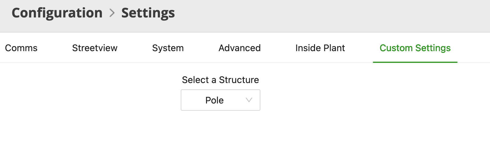
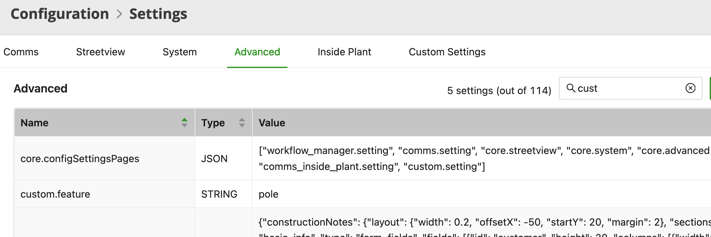

# Custom Settings Tab - Overview

## Table of Contents

- [Custom Settings Tab - Overview](#custom-settings-tab---overview)
  - [Table of Contents](#table-of-contents)
  - [Tool Description](#tool-description)
  - [How to use the tool](#how-to-use-the-tool)

---

## Tool Description

This sample demonstrates how to create a Custom Settings Tab under `Configuration -> Settings`, where the user can save an advanced configuration and then read the configuration within an application.

## How to use the tool

First, in `Configurations -> Settings`, select the "Custom Settings" tab. Then select a feature type in the dropdown (Fig. 1).

<i>Fig. 1: The Custom Settings tab within Configuration -> Settings</i>

Once a feature type is selected the Advanced configuration parameter is automatically updated, you can check the new value under the `Advanced` tab in the `custom.feature` parameter (Fig. 2). If the value is not updated try refreshing the tab.

<i>Fig. 2: The custom.feature Advanced configuration parameter showing the selected Feature</i>

After setting the parameter the sample is available in the "DevRel Samples App - NMT" application inside the "Samples Menu" option click on the "Custom Settings Tab" and the currently selected Feature (which was saved in the Advanced configuration parameter) is displayed in the development console.