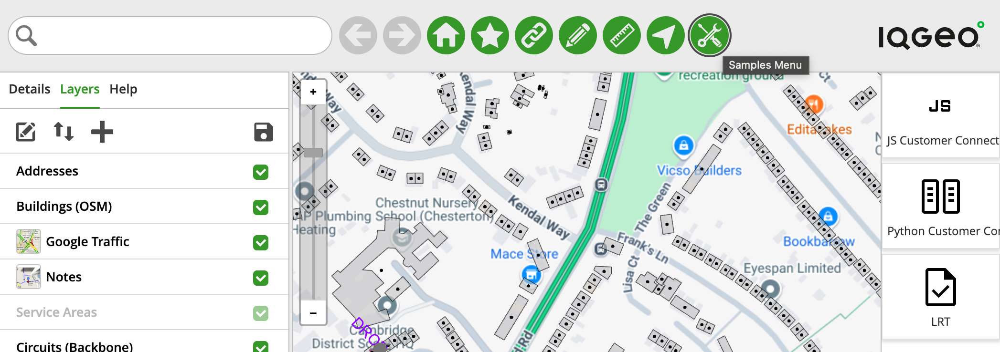

# Long Running Tasks (LRT) - Python - Overview

## Table of Contents

- [Long Running Tasks (LRT) - Python - Overview](#long-running-tasks-lrt---python---overview)
  - [Table of Contents](#table-of-contents)
  - [Tool Description](#tool-description)
  - [How to use the tool](#how-to-use-the-tool)

---

## Tool Description

The tool uses the Long Running Task (LRT) framework that is designed to handle high-volume/compute-intensive tasks that if performed with Javascript on the client would degrade the end-user experience (e.g. time-out errors).  The framework combines Python script execution on the server with task queues managed by Python RQ backed by a Redis instance that is already available in the containerized environment.  

Because of the "long-running" nature of the tasks, the example includes a technique for providing useful feedback to the end user about the progress of the task.

Similar to the use cases found elsewhere in the Samples, we are looking to automate the creation of a connection between a Pole and an Address.  But in this case we are creating connections to 2000 random addresses in order to demonstrate the LRT functionality.

Starting with an empty Design polygon, the script creates the necessary Structures and Equipment to create a Fiber connection:

- Creates a new pole
    - Adds a Splice Closure to the Pole
    - Adds a Fiber Splitter to the Splice Closure
        - Once the 24 ports on the Fiber Splitter are filled, it creates another Pole
  
- Within a random Address
    - Adds a Wall Box at the Address location
    - Adds an ONT to the Wall Box housing
    - Creates a Route between the Pole and Wall Box at the address
    - Connects the Cable to a Pin in the Fiber Splitter
    - Connects the Cable to a Pin in the ONT

The user is provided feedback on the progress of the 2000 connections being made via a message in the modal dialog.

## How to use the tool

This tool is available in the "DevRel Samples App - NMT" application inside the "Samples Menu" option, clicking on it will open the Palette Menu to the right side of the map

<i>Fig. 1: "Samples Menu" option location and the Palette menu open to the right side of the map</i>

Click the "LRT" button on the Palette Menu and a pop-up window will show with a brief description of the tool, click the "OK" button and the tool window will show up (Fig. 2)

<i>Fig. 2: The Long Running Task Tool window</i>

To use the tool create an empty Design polygon--with its state set to "Designing"-- and select it.

Clicking the "Create Connections using LRT" button will kick off the task, as connections are made, the Task Status in the modal dialog will be updated so the user can monitor the progress of the task.

Once all 2000 connections have been made, you will see a Success message in the modal window.  Refreshing the map with a pan or zoom will draw the 2000 new connections (as long as the Layers are toggled on in the left-side table of contents).
(Fig. 3)

<i>Fig. 3: The Success message of the completed Long Running Task</i>

Note that these 2000 new connections are part of the selected Design--they have not been added to the main database.  Deleting the Design will also delete all of the Structures and Equipment associated with the 2000 connections just created.  (Note too that there is no requirement that features associated with a Design be located within the boundary of the Design polygon.)