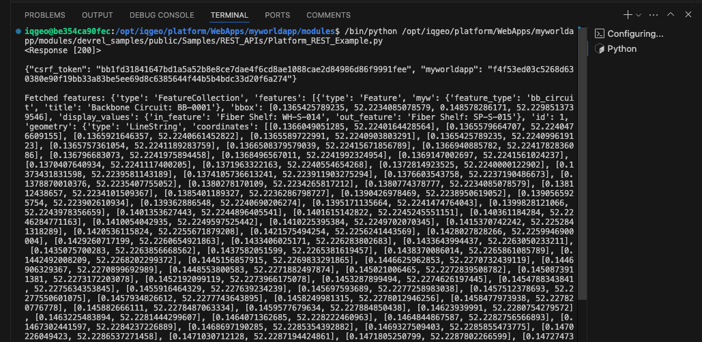

# REST APIs - Overview

## Table of Contents

- [REST APIs - Overview](#rest-apis---overview)
  - [Table of Contents](#table-of-contents)
  - [Tool Description](#tool-description)
  - [How to use the tool](#how-to-use-the-tool)

---

## Tool Description

REST APIs allow developers to build interfaces from other systems to the IQGeo Platform. In the library there are two files: `platform_REST_example.py` and `NMT_REST_example.py`, with examples for the Platform and NMT REST APIs, repectively.

## How to use the tool

The `platform_REST_example.py` and `NMT_REST_example.py` are located in the `modules/devrel_samples/public/Samples/REST_APIs`. The samples are two Python scripts that can be executed within VS Code using the "Run Python File" command. Ensure that your Python environment within VS Code is properly set before 

Before running the sample ensupre that you properly set the URL variables in each file to the address of your development environment.

Once the URLs are set, run the "Run Python File" command and the output of the commands will be shown in the Terminal Window. The output for the `platform_REST_example.py` sample is, in order (Fig. 1).

- The response code for the authentication request
- The dictionary of cookies received as response
- The output of the `seelct` request for backbone circuits
- 

<i>Fig. 1: Platform REST API output example. The `select` request output may vary depending on your database</i>

The output for the `NMT_REST_example.py` sample is similar, but for a relevant NMT query, you can find out more at the [REST APIs Deep Dive](./REST_APIs_DeepDive.md) document.