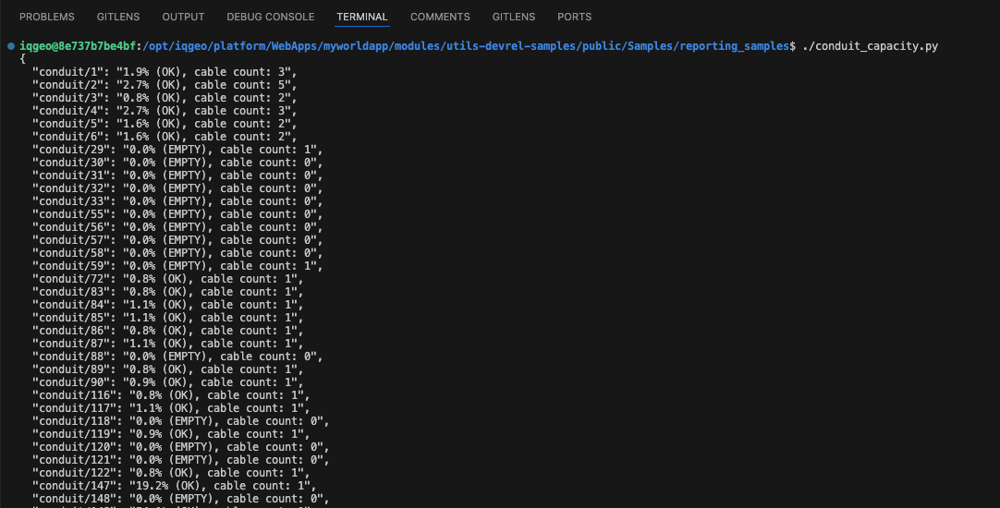

# Reporting Samples - Overview

## Table of Contents

- [Reporting Samples - Overview](#reporting-samples---overview)
  - [Table of Contents](#table-of-contents)
  - [Tool Description](#tool-description)
  - [How to use the tool](#how-to-use-the-tool)

---

## Tool Description

This sample provides examples for how to query the database and create reports similar to the Enterprise "Data Warehouse" reports using the available REST APIs. These examples are designed for Professional customers to: 

- Authenticate via **RPOC auth** or **JWT auth** to get started
- Query feature data in various ways to mimic "Data Warehouse" reporting

The goal is to make REST API–based reporting as straightforward as possible, even without a replica database. All examples are written in **Python** with examples for conduit capacity, pole attachment, and spatial querying reports. 

As a stretch goal, we may also provide **code-free options** using tools like **FME** or **Postman**, to give Professional Edition customers an experience closer to Enterprise’s no-code “Data Warehouse” reporting workflows.

Use this sample as a reference if you want to:

- Understand spatial query workflows.
- Extend results handling into custom reporting or UI logic.
- Experiment quickly with geometry-based searches before building larger tools.

## How to use the tool

The python scripts for reporting are located `modules/devrel-samples/public/Samples/reporting_samples`. The samples are three Python scripts that can be excuted within VS Code using the "Run Python File" command, or creating an executable for each script. Below are the instructions for creating the executable:

1. Creating the executable
    `chmod +x <file_name>.py`

2. Run as executable
    `./<file_name>.py`

3. Using arguments
    Each of the scripts take command line arguments for authentication and/or design specs. To use Python Argparse, run the Python files like so:
    `./<file_name>.py --token_file <token_file_path> --design <design_name>`

    Note: `spatial_query.py` only takes in the token file path argument.

4. OR use the `python` command to run
    `python3 <file_name>.py --token_file <token_file_path> --design <design_name>`

The script will pause briefly while authenticating with the token. Once authenticated, the report is printed to the terminal in JSON format.

<i>Fig. 1: Conduit Capacity report output example.</i>
