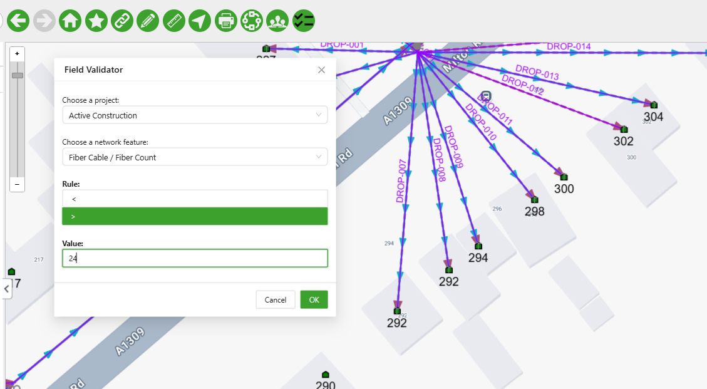
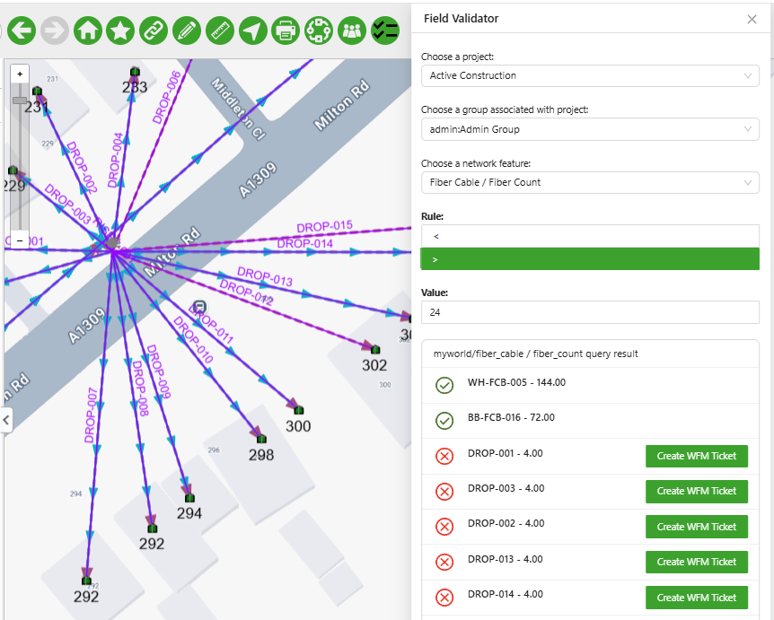
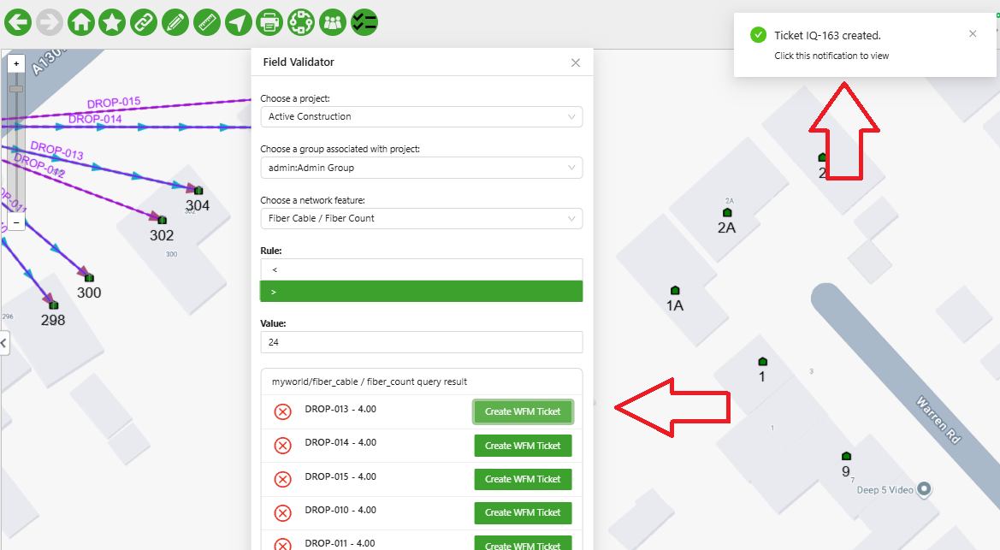
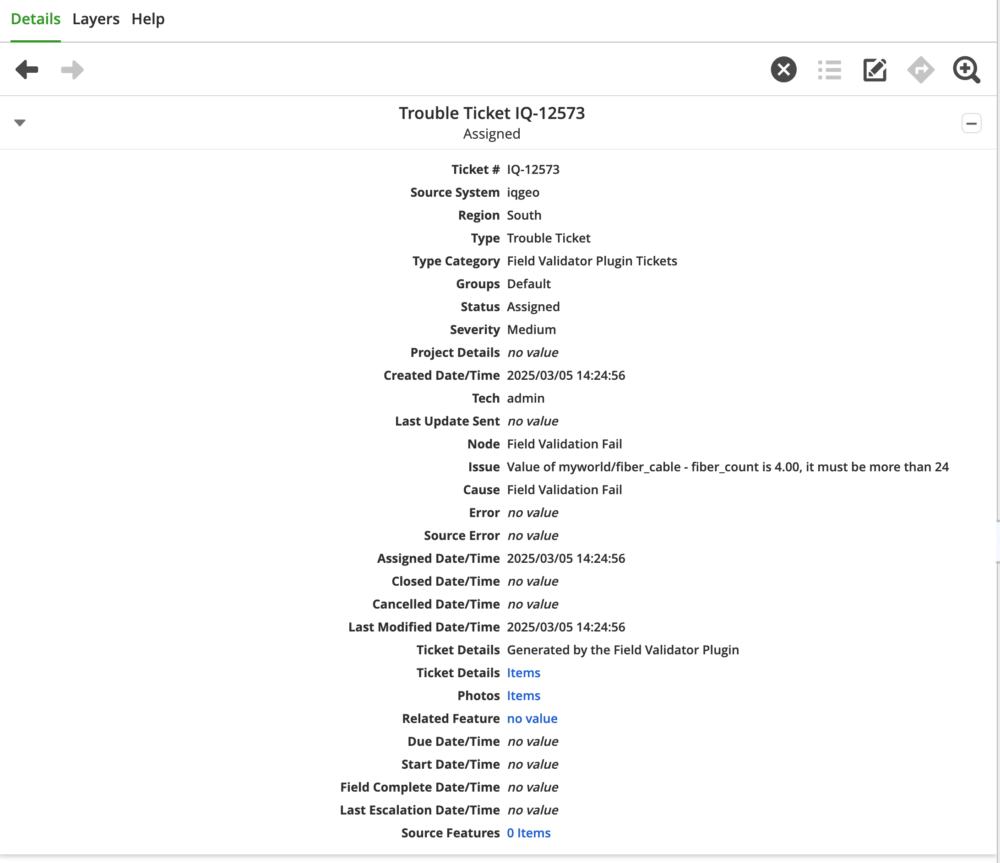

# WFM/NMT Integration - Overview

## Table of Contents

-   [WFM/NMT Integration - Overview](#wfmnmt-integration---overview)
    -   [Table of Contents](#table-of-contents)
    -   [Tool Description](#tool-description)
    -   [How to use the tool](#how-to-use-the-tool)

---

## Tool Description

The integration between the Workflow Manager (WFM) and Network Manager Telecom (NMT), allows users to manipulate WFM tickets from within NMT, making the processing of these tickets easier and more streamlined.

This sample allows the user to query the features database with a rule and create tickets associated with features that break this rule.

For instance I want to ensure all my fiber cables have more than 24 fibers, if any of the cables have less than 24 fibers a ticket is created with basic information (that can be later edited) to replace this cable.

## How to use the tool

This Field Validator tool is available in the `main.wfm_nmt_integration.js` application configuration file in the top menu

<i>Fig. 1: Field Validator Tool location in the toolbar</i>

When clicking the button a modal window will open where the user:

-   selects a project the ticket to which the ticket will be assigned
-   selects a group that is associated with the selected project
-   selects a feature
    -   then selects a feature's field to be validated

Depending on the data type of field selected (the tool works with numeric, string, and boolean data types), the proper fields are shown:

-   If the field is a string, the rules are "must contain" and "must not contain" a substring
-   If the field is a number, the rules are if the field is greater than or less than a given number
-   If the field is a boolean, the rule is to check if the field is True or False

In Fig. 2 below you can see a rule configured

<i>Fig. 2: Field Validator Tool window with a rule configured (Fiber cables must have more than 24 fibers)</i>

&#8291;
&#8291;

When the user presses OK the rule is checked agains all the features that are **currently visible in the map** (i.e.: If the map is zoomed in, fewer features will be checked, if it is zoomed all the way out it will check all the features in the world).

Once the check is done a list of all checked features is shown with a sign indicating if the feature complies with the rule. If the feature breaks the rule a button is shown allowing a ticket to be created (Fig. 3). Clicking on a feature in the list will focus the map on that feature. Additionaly, next to the feature's name you can see its value for the field being checked.

<i>Fig. 3: Output of the rule checking, you can see that all cables that have less than 24 fibers have failed the check and tickets can be created</i>

&#8291;
&#8291;

When the "Create WFM Ticket" button is pressed the ticket is created and a pop-up with the number of the ticket is shown, and clicking in the pop-up the ticket details are shown in the "Details" tab (Fig. 4 and Fig. 5). Note that the newly created ticket will inherit the geometry of the design element to which it is related and this ticket geometry is added to the map interface.

<i>Fig. 4: Ticket created, notice the ticket number in the top right corner</i>

&#8291;
&#8291;

<i>Fig. 5: Ticket details in the "Details" tab </i>

