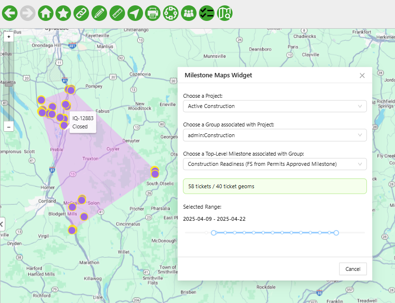
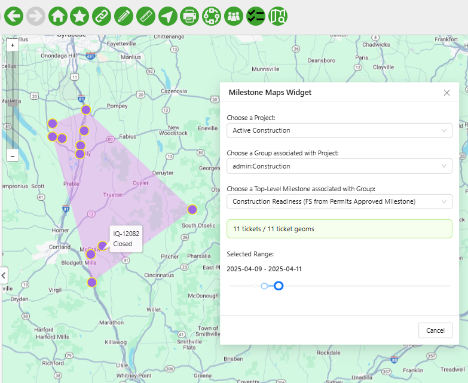

# WFM/NMT Milestone Map Widget - Overview

## Table of Contents

-   [WFM/NMT Milestone Map Widget - Overview](#wfmnmt-integration---overview)
    -   [Table of Contents](#table-of-contents)
    -   [Tool Description](#tool-description)
    -   [How to use the tool](#how-to-use-the-tool)

---

## Tool Description

This tool is built in an environment with Workflow Manager (WFM) integrated with Network Manager Telecom (NMT), but can easily be re-used in environments where WFM is integrated with other Network Managers (e.g. Electric, Gas, et al).

This sample enables to user to map tickets associated with specific WFM Milestones associated with a user-selected Project and Group. The tool includes a time slider to permit visualizing tickets that fall within the user-selected range of their milestones' planned beginning and end dates

## How to use the tool

This Milestone Map Widget tool is available in the `main.wfm_nmt_integration.js` application configuration file in the top menu

<i>Fig. 1: Milestone Map Widget Tool location in the toolbar</i>

When clicking the button a modal window will open where the user:

-   selects a WFM Project
-   selects a WFM Group
-   selects a parent Milestone associated with the selected Project/Group combination

Once a milestone is chosen, the following happens on the map

-   A search of a Milestone's "immediate children" milestones is executed
-   The tickets of both the parent milestone and the immediate children's milestones are mapped, along with a polygon bouding those tickets
-   a time slider is presented to the user with the full date range of the milestones

In Fig. 2 below you can see a milestone selected

<i>Fig. 2: Milestone Map Widget with Tickets Mapped</i>

&#8291;
&#8291;

The user can then adjust the time slider and the tickets displayed will be filtered by the milestones that fall within the new date range.

-   Note that not all tickets have a geometry associated with them. The status message includes both the total number of tickets associated with the chosen milestones as well as the number of tickets being mapped.

<i>Fig. 3: Tickets are Interactively Filtered by User Setting Custom Date Range With Slider</i>

&#8291;
&#8291;

Notes:

-   Mousing over a ticket displays the ticket ID and ticket status.
-   Both the ticket points and the bounding polygon are temporary map layers which are removed when the modal window is closed.
